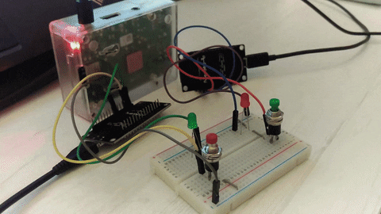
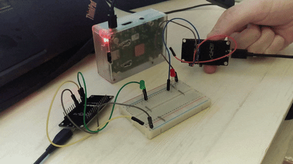

# Exploring MQTT With The ESP8266

In any IoT project, we have a number of unique requirements and restrictions. The communication strategy to connect devices and send data between them is critically important. 

In this project, we will explore a powerful, simple and lightweight messaging protocol over the wire: MQTT.

Full guide [published on my blog](https://kokonatt.com/embedded/mqtt-with-esp8266).

## Table of contents
* [MQTT Basics](https://kokonatt.com/embedded/mqtt-with-esp8266#mqtt-basics)
* [Dev Environment](https://kokonatt.com/embedded/mqtt-with-esp8266#dev-environment)
* [ESP8266 Filesystem](https://kokonatt.com/embedded/mqtt-with-esp8266#esp-filesystem)
* [Communicating Two Devices](https://kokonatt.com/embedded/mqtt-with-esp8266#two-devices)
* [Tracking Devices Status](https://kokonatt.com/embedded/mqtt-with-esp8266#last-will)

## A preview of what you can build

### Communicating two devices

### Tracking device status (last will message)
